# Technical Proposal: Deal Similarity System

## Executive Summary

This proposal describes a scalable system architecture for surfacing similar historical deals to new CIM opportunities. The design centers on multi-modal deal representations combining structured CRM metrics with unstructured document embeddings, stored in a hybrid vector/metadata database for efficient similarity search. Analyst feedback enables continuous refinement of representations and search logic.

**Key Capabilities:**
- Multi-modal deal representation (structured metrics + unstructured text embeddings)
- Context-dependent similarity matching (screening, risk assessment, exit potential, strategic fit)
- Continuous learning from analyst feedback
- Explainable results with attribution breakdown
- Scalable architecture supporting 10K+ historical deals

---

## 1. System Architecture

### 1.1 High-Level Architecture

```
[CRM + Document Repos] → [Ingestion Layer] → [Embedding Service] → [Vector + Metadata Store]
                                                                 ↓
[New CIM Input] → [Retrieval API] → [Analyst UI + Feedback] → [Tuning Loop]
```

The system is built as a set of services around a "deal similarity" core:

- **Ingestion Layer**: Connectors normalize CRM data, OCR-parse CIM PDFs using LayoutLM for layout-aware extraction. Handles currency conversion, date normalization, and sector taxonomy standardization.
- **Embedding Service**: Generates composite deal representations from structured + unstructured data. Produces standardized multi-modal representation objects that can be versioned.
- **Vector + Metadata Store**: Hybrid database coupling a vector store (Pinecone/FAISS for ANN similarity search) with a relational/document store (PostgreSQL for metadata filtering by sector, date, outcome, fund, geography).
- **Retrieval & Ranking API**: Processes new deals, computes embeddings, runs similarity search, then applies re-ranking logic (weighting by recency, sector match, analyst feedback) before returning results.
- **Analyst UI + Feedback**: Workflow-integrated interface showing similar deals with explainability. Enables analysts to mark deals as useful/not useful, pin favorites, or adjust weights.
- **Offline Training / Tuning Loop**: Periodic jobs that retrain weights for combining modalities, update normalization parameters, and evaluate retrieval quality using historical data and feedback logs.

This separation enables iteration on models and similarity logic without touching CRM integrations or the UI.

### 1.2 Detailed Process Flow

The following diagram illustrates the complete end-to-end process flow, including all stages, decision points, and sub-modules:

```mermaid
flowchart TD
    %% Data Sources
    A[CRM System] --> B1[Ingestion Layer]
    A2[Document Repository<br/>CIMs, Memos, Notes] --> B1
    A3[External Data Sources<br/>Market Data, Macros] --> B1
    
    %% Ingestion Layer - Sub-modules
    B1 --> B2[CRM Connector<br/>• Field Mapping<br/>• Currency Conversion<br/>• Date Normalization]
    B1 --> B3[Document Parser<br/>• PDF OCR/LayoutLM<br/>• Section Extraction<br/>• Table Parsing]
    B1 --> B4[Data Validator<br/>• Schema Validation<br/>• Completeness Check<br/>• Quality Scoring]
    
    %% Decision Point: Data Quality
    B2 --> D1{Data Quality<br/>Pass?}
    B3 --> D1
    B4 --> D1
    
    D1 -->|Fail| B5[Manual Review Queue<br/>• Flagged Deals<br/>• Error Logging<br/>• Admin Notification]
    D1 -->|Pass| C1[Embedding Service]
    B5 --> B1
    
    %% Embedding Service - Sub-modules
    C1 --> C2[Structured Encoder<br/>• Financial Normalization<br/>• Log/Z-score Transform<br/>• Categorical Embeddings<br/>• Temporal Features]
    C1 --> C3[Text Encoder<br/>• Sentence-Transformers<br/>• FinBERT/Tuning<br/>• Section-level Embeddings<br/>• IC Memo Weighting]
    C1 --> C4[Tag Extractor<br/>• Pattern Recognition<br/>• Qualitative Tags<br/>• Risk Indicators]
    
    C2 --> C5[Multi-Modal Fusion<br/>• Joint/Late Fusion<br/>• Weight Combination<br/>• Context-specific Heads]
    C3 --> C5
    C4 --> C5
    
    %% Storage
    C5 --> E1[Vector Store<br/>FAISS/Pinecone<br/>• Embedding Vectors<br/>• ANN Index]
    C5 --> E2[Metadata Store<br/>PostgreSQL<br/>• Structured Features<br/>• IDs, Labels<br/>• Outcome, Fund, Geo]
    
    %% Query Flow
    F1[New CIM Input] --> F2[Query Preprocessor<br/>• Extract Metadata<br/>• Parse Documents<br/>• Identify Context]
    
    F2 --> D2{Query Type?}
    D2 -->|Structured Only| G1[Structured Encoder]
    D2 -->|Text Only| G2[Text Encoder]
    D2 -->|Multi-Modal| G3[Multi-Modal Encoder]
    
    G1 --> H1[Similarity Search Engine]
    G2 --> H1
    G3 --> H1
    
    %% Similarity Computation
    H1 --> H2[Vector Search<br/>• ANN Query<br/>• Cosine Distance<br/>• Top-K Retrieval]
    H1 --> H3[Metadata Filter<br/>• Sector Match<br/>• Date Range<br/>• Outcome Filter]
    
    H2 --> I1[Similarity Scorer<br/>• s_struct: Euclidean<br/>• s_text: Cosine<br/>• s_meta: Categorical]
    H3 --> I1
    
    I1 --> I2[Context Weighting<br/>• Screening: w=0.7/0.3<br/>• Risk: w=0.2/0.7<br/>• Exit: w=0.5/0.5<br/>• Strategic: w=0.1/0.8]
    
    I2 --> J1[s_final = w_struct·s_struct +<br/>w_text·s_text + s_meta]
    
    %% Decision Point: Match Quality
    J1 --> D3{Match Quality<br/>Threshold > 0.6?}
    
    D3 -->|Yes| K1[Ranking & Re-ranking<br/>• Diversity Penalty<br/>• Recency Boost<br/>• Feedback Boost<br/>• Personalization]
    D3 -->|No| K2[Fallback Handler<br/>• Adjacent Sector Search<br/>• Keyword Search<br/>• Alert: Low Confidence]
    
    K2 --> K3[Escalation Workflow<br/>• Senior Partner Review<br/>• Manual Comp Selection]
    K1 --> L1[Result Formatter<br/>• Attribution Breakdown<br/>• Highlighted Snippets<br/>• Comparison Attributes]
    
    %% UI Layer
    L1 --> M1[Analyst UI<br/>• Deal Comparison View<br/>• Explainability Panel<br/>• Weight Sliders]
    K3 --> M1
    
    M1 --> M2[Feedback Collector<br/>• Useful/Not Useful<br/>• Pin Favorites<br/>• Override Matches<br/>• Weight Adjustments]
    
    %% Decision Point: Feedback
    M2 --> D4{Analyst Feedback<br/>Received?}
    
    D4 -->|Yes| N1[Feedback Logger<br/>• Label: +1/-1<br/>• Context Capture<br/>• Interaction Tracking]
    D4 -->|No| M1
    
    %% Continuous Learning Loop
    N1 --> O1[Feedback Store<br/>PostgreSQL<br/>• Query-Deal Pairs<br/>• Labels & Context<br/>• Timestamps]
    
    O1 --> P1{Training Trigger?<br/>Batch Size/<br/>Time Interval}
    
    P1 -->|Yes| Q1[Model Training Service<br/>• Contrastive Loss<br/>• Projection Layer Update<br/>• Weight Re-tuning<br/>• Normalization Params]
    P1 -->|No| O1
    
    Q1 --> Q2[Model Evaluator<br/>• Precision@K<br/>• Recall@K<br/>• A/B Testing]
    
    Q2 --> D5{Model Performance<br/>Improved?}
    
    D5 -->|Yes| Q3[Model Deployment<br/>• Version Control<br/>• A/B Rollout<br/>• Monitoring]
    D5 -->|No| Q4[Hyperparameter Tuning<br/>• Learning Rate<br/>• Batch Size<br/>• Architecture]
    
    Q3 --> C1
    Q4 --> Q1
    
    %% Styling
    classDef decisionPoint fill:#ffd700,stroke:#333,stroke-width:3px
    classDef processBox fill:#e1f5ff,stroke:#01579b,stroke-width:2px
    classDef dataStore fill:#c8e6c9,stroke:#2e7d32,stroke-width:2px
    classDef feedbackLoop fill:#fff3e0,stroke:#e65100,stroke-width:2px
    
    class D1,D2,D3,D4,D5 decisionPoint
    class B2,B3,B4,C2,C3,C4,C5,F2,G1,G2,G3,H2,H3,I1,I2,K1,K2,L1,M2,N1,Q1,Q2,Q4 processBox
    class E1,E2,O1 dataStore
    class M2,N1,O1,P1,Q1,Q2,Q3,Q4 feedbackLoop
```



**Key Stages and Decision Points Explained:**

#### **Stage 1: Data Ingestion**
- **CRM Connector**: Normalizes fields, converts currencies, standardizes dates and sector taxonomies
- **Document Parser**: Uses LayoutLM for layout-aware PDF parsing, extracts sections and tables
- **Data Validator**: Ensures schema compliance and data completeness
- **Decision Point 1**: Data quality gate - failed data goes to manual review queue

#### **Stage 2: Embedding Generation**
- **Structured Encoder**: Normalizes financials (log-transform, z-scores), creates categorical embeddings, adds temporal features
- **Text Encoder**: Uses domain-tuned models (FinBERT/sentence-transformers), creates section-level embeddings, weights IC memos higher
- **Tag Extractor**: Identifies qualitative patterns and risk indicators
- **Multi-Modal Fusion**: Combines structured and text embeddings using joint or late fusion strategies

#### **Stage 3: Storage**
- **Vector Store**: Stores high-dimensional embeddings with ANN indexing for fast similarity search
- **Metadata Store**: Stores structured features, IDs, labels, and filtering attributes

#### **Stage 4: Query Processing**
- **Query Preprocessor**: Extracts context and identifies query type
- **Decision Point 2**: Routes to appropriate encoder based on query type (structured, text, or multi-modal)

#### **Stage 5: Similarity Search & Scoring**
- **Vector Search**: Performs approximate nearest-neighbor search using cosine distance
- **Metadata Filter**: Applies sector, date, and outcome filters
- **Similarity Scorer**: Computes structured, text, and metadata similarity scores
- **Context Weighting**: Applies context-dependent weights (screening, risk, exit, strategic)

#### **Stage 6: Result Ranking**
- **Decision Point 3**: Match quality threshold check - low-confidence results trigger fallback
- **Ranking & Re-ranking**: Applies diversity penalty, recency boost, feedback-based boosts, personalization
- **Fallback Handler**: Expands search to adjacent sectors or uses keyword search for low-confidence cases
- **Result Formatter**: Creates explainable results with attribution breakdown

#### **Stage 7: Analyst Interface & Feedback**
- **Analyst UI**: Displays results with comparison views, explainability panels, and adjustable weight sliders
- **Feedback Collector**: Captures analyst interactions (useful/not useful, pins, overrides, weight adjustments)
- **Decision Point 4**: Triggers feedback logging when analyst provides input

#### **Stage 8: Continuous Learning Loop**
- **Feedback Logger**: Stores labeled query-deal pairs with context
- **Training Trigger**: Determines when to retrain based on batch size or time intervals
- **Model Training**: Uses contrastive learning to update projection layers and weights
- **Model Evaluator**: Measures precision@K, recall@K, and A/B test performance
- **Decision Point 5**: Determines if model improvement is significant enough for deployment
- **Model Deployment**: Versions and deploys improved models back to embedding service

**Critical Feedback Loops:**
1. **Short-term**: Analyst feedback immediately influences ranking and personalization
2. **Medium-term**: Batch feedback triggers model weight updates
3. **Long-term**: Periodic retraining improves embedding quality and fusion strategies

**Decision Points Summary:**

| Decision Point | Condition | Action if TRUE | Action if FALSE |
|----------------|-----------|----------------|-----------------|
| **D1: Data Quality** | Validation passes schema checks, completeness thresholds, quality score > threshold | Proceed to embedding generation | Route to manual review queue, log errors, notify admin |
| **D2: Query Type** | Query contains structured filters only | Use structured encoder only | Check for text content → route to text or multi-modal encoder |
| **D3: Match Quality** | Top similarity score > 0.6 threshold | Proceed to ranking and re-ranking | Trigger fallback handler (adjacent sectors, keyword search, escalation) |
| **D4: Feedback Received** | Analyst provides useful/not useful, pins, or adjusts weights | Log feedback with context for training | Continue normal operation, await feedback |
| **D5: Model Performance** | New model improves precision@K, recall@K, or A/B test metrics | Deploy new model version, update embedding service | Continue hyperparameter tuning or wait for more feedback data |

**Sub-Modules Breakdown:**

| Main Component | Sub-Modules | Key Functionality |
|----------------|-------------|-------------------|
| **Ingestion Layer** | CRM Connector<br/>Document Parser<br/>Data Validator | Field mapping, currency conversion, date normalization<br/>PDF OCR/LayoutLM, section extraction, table parsing<br/>Schema validation, completeness check, quality scoring |
| **Embedding Service** | Structured Encoder<br/>Text Encoder<br/>Tag Extractor<br/>Multi-Modal Fusion | Financial normalization, log/z-score transforms, categorical embeddings, temporal features<br/>Sentence-transformers/FinBERT, section-level embeddings, IC memo weighting<br/>Pattern recognition, qualitative tags, risk indicators<br/>Joint/late fusion, weight combination, context-specific heads |
| **Similarity Search** | Vector Search<br/>Metadata Filter<br/>Similarity Scorer<br/>Context Weighting | ANN query, cosine distance, top-K retrieval<br/>Sector match, date range, outcome filter<br/>Structured/text/metadata similarity computation<br/>Context-dependent weight application (screening, risk, exit, strategic) |
| **Ranking & Results** | Ranking Engine<br/>Fallback Handler<br/>Result Formatter | Diversity penalty, recency boost, feedback boost, personalization<br/>Adjacent sector search, keyword search, low confidence alerts<br/>Attribution breakdown, highlighted snippets, comparison attributes |
| **Feedback Loop** | Feedback Logger<br/>Model Training<br/>Model Evaluator<br/>Model Deployment | Label storage, context capture, interaction tracking<br/>Contrastive loss, projection layer updates, weight re-tuning<br/>Precision@K, recall@K, A/B testing<br/>Version control, A/B rollout, monitoring |

### 1.3 Deal Representation Strategy

Each deal is represented as a **structured schema plus one or more vectors**:

**Concrete Example:**
```
Deal ID: "cloudsecure-2025"
├── Metadata: {sector: "Software", geography: "US", deal_type: "Growth", year: 2025}
├── Structured Features: [log_rev=3.4, growth_z=0.9, margin_z=0.7, ...] (128-dim)
├── Text Embeddings:
│   ├── cim_overall: [0.12, -0.45, ...] (1024-dim)
│   ├── business_section: [...]
│   └── ic_memo: [...]
└── Qualitative Tags: ["high_churn_risk", "usage_pricing"]
```

**Detailed Components:**

- **Core Metadata**: ID, company name, date, geography, sector/subsector (normalized taxonomy), deal type (buyout, growth, minority, etc.), sponsor vs founder-owned, and outcome (invested, passed, lost).

- **Financial Feature Block**: Time-normalized metrics including:
  - Size: revenue, EBITDA, enterprise value, deal size
  - Profitability: margins, capex intensity, FCF margins
  - Growth: 1-, 3-, 5-year CAGR where available
  - Capital structure: leverage, interest coverage, etc.

- **Qualitative Tags**: Patterns derived from text, such as "roll-up platform," "software with usage-based pricing," "regulated market," "customer concentration," "contracted revenue," etc.

- **Document Embeddings**: Vector representations for:
  - CIM overall
  - Key sections (business overview, market, competition, financials)
  - Investment committee memo, first-visit notes

**Internal Representation:**

A deal can be thought of as:
- A **structured feature vector** $x^{struct}$ (dozens to a few hundred numbers)
- A **text embedding vector** $x^{text}$ (e.g., 768–4096 dimensions)
- Optional **section-level vectors** for finer-grained retrieval (e.g., one vector per CIM section)

The system computes similarity using these components either separately (e.g., "similar documents but not necessarily similar size") or in a fused way ("overall deal similarity").

---

## 2. Embedding and Representation Strategies

### 2.1 Structured Metrics

For structured data, the goal is to make distances meaningful:

**Normalization and Scaling:**
- Convert monetary values to common currency and scale with log transforms or z-scores so a tenfold revenue difference is treated reasonably
- Growth rates and margins are standardized per sector since they're already bounded

**Categorical Encoding:**
- Sectors, subsectors, regions use learned embeddings (not just one-hot), so similar sectors (e.g., healthcare IT and general SaaS) are closer than unrelated ones (e.g., SaaS vs mining)
- Deal type, ownership type, and stage also get embeddings
- Enables similarity queries like "similar growth in adjacent sectors"

**Temporal Features:**
- Include deal year, "pre-COVID / COVID / post-COVID" flags, and macro tags (e.g., low-rate vs high-rate environment)
- Ensures similarity reflects changing market regimes

**Initial Representation:**
A simple starting representation is a concatenated vector of normalized numeric features and dense categorical embeddings. Later, this can feed a small neural encoder or autoencoder to learn a compressed embedding that places "economically similar" deals closer together.

### 2.2 Text and Document Embeddings

For unstructured content, the goals are to capture:
- Business model specifics (pricing, customer type, go-to-market)
- Market context and competitive dynamics
- Qualitative risk/reward drivers (e.g., regulatory risk, customer concentration, key-person risk)

**Text Extraction:**
- Use layout-aware PDF parser so tables, headings, and bullets are parsed sensibly
- Avoids losing important context like which numbers are historical vs projected

**Base Models:**
- Start with strong sentence/document embedding models (e.g., modern sentence-transformer tuned for semantic similarity)
- For financial language, consider domain-tuned versions (e.g., FinBERT), or further fine-tune on the firm's own corpus using contrastive learning (pull together sections from same deal, push apart unrelated deals)

**Section-Level Embeddings:**
- Compute embeddings at section granularity (e.g., one vector for "business overview," one for "market," one for "financial highlights")
- Supports targeted queries like "show deals with similar market dynamics even if the financial profile differs"

**IC Memo / Notes Embeddings:**
- Investment memos and analyst notes get higher weight due to decision rationale capture
- Often closer to how the firm actually reasons ("strong product, but high churn; concerns on management depth")

### 2.3 Multi-Modal Fusion Strategies

There are several pragmatic ways to fuse structured and text representations:

**Joint Fusion:**
```
FFN(concat(x_struct, x_text))  // Contrastive training
```
- Concatenate $x^{struct}$ and $x^{text}$ and pass through a small feed-forward network to obtain joint embedding
- Trained using historical labels (deals evaluated by same team, or deals analysts manually mark as "similar")

**Late Fusion / Weighted Similarity:**
```
s_final = w_struct · s_struct + w_text · s_text  // w=[0.4, 0.6] initial
```
- Compute structured similarity score $s_{struct}$ and text similarity score $s_{text}$, then combine them
- $\alpha$ is tunable by context or analyst preference
- Easy to reason about and can be changed per use case (e.g., screening may rely more on structure, deep dives more on text)

**Context-Specific Heads:**
- Different weighting schemes or small models for different "similar for what" contexts (e.g., "similar growth story," "similar risk pattern," "similar exit outcome")
- Each uses the same underlying embeddings but different combination weights

This approach keeps the system modular: embeddings are reusable assets, while similarity logic can evolve separately as analysts give feedback.

### 2.4 Handling Multi-Modality in Practice

Multi-modality requires letting each modality shine when it's most informative:

**Separate Encoders:**
- One encoder stack for structured features, one for long-form text, optionally another for tables extracted from PDFs

**Alignment and Training:**
- Use contrastive objectives where positive pairs are different views of the same deal (structured vs text) and negatives are random deals, so representations of the same underlying deal end up near each other in embedding space
- Use signals like "analyst considered these two deals during the same evaluation" or "deal A was used as a comp in memo for deal B" as additional positive pairs for training

**Modality-Aware Retrieval:**
- Allow structured-only retrieval when query is structured (e.g., simple numeric filter from CRM)
- Allow text-only retrieval when query is free-form (e.g., "find roll-up platforms with high customer concentration in healthcare IT")
- Use fused retrieval for standard "find similar deals to this new CIM" workflow

**User Experience Requirements:**
- Analysts can **see why** a deal was retrieved: show key aligned attributes (sector match, similar revenue and growth, same deal type) as well as highlighted memo snippets that drove text similarity
- Analysts can adjust **sliders or presets** (e.g., "financial similarity high, sector similarity medium, memo similarity high"), which directly tweak fusion weights; interactions are logged and used later to tune the model

---

## 3. Similarity Scoring and Matching

### 3.1 Defining and Measuring Similarity

**Similarity is multi-dimensional and context-dependent**: Two deals are similar if they share economic, strategic, and risk profiles relevant to the evaluation context.

**Core Metric: Weighted Hybrid Similarity Score**

```
s_struct = 1 - (||x_struct_1 - x_struct_2||_2 / √d)     // Normalized Euclidean (financials)
s_text = cosine(x_text_1, x_text_2)                      // Semantic document similarity  
s_meta = 0.2·sector_match + 0.1·geo_align + e^(-|Δyear|/5)  // Categorical + recency

s_final = w_struct·s_struct + w_text·s_text + s_meta     // w=[0.4, 0.6] initial
```

This captures:
- **Financial comparability** (s_struct): Similar revenue, growth, margins, capital structure
- **Business model/market alignment** (s_text): Similar pricing, customer type, competitive dynamics
- **Practical constraints** (s_meta): Sector alignment, geographic relevance, temporal recency

### 3.2 Context-Dependent Similarity

**Multiple similarity modes** via adjustable weights or separate scorers:

| Context | w_struct | w_text | s_meta Focus | Example Query |
| :-- | :-- | :-- | :-- | :-- |
| **Screening** | 0.7 | 0.3 | Sector + Size | "Growth profiles in SaaS" |
| **Risk Assessment** | 0.2 | 0.7 | Geography | "Churn risks in enterprise software" |
| **Exit Potential** | 0.5 | 0.5 | Year + Outcome | "Similar multiples achieved" |
| **Strategic Fit** | 0.1 | 0.8 | Team/Fund | "Roll-up platforms in healthcare IT" |

**Implementation**: Analyst selects preset or sliders in UI → dynamically recompute rankings. Log preferences for personalization.

### 3.3 Limitations of Pure Embedding-Based Similarity

**Key Failure Modes:**

- **Market regime shifts**: 2019 low-rate SaaS deals ≠ 2025 high-rate (handled via temporal decay)
- **Sparse data**: New subsectors lack historical comps (mitigate via sector hierarchies)
- **Outcome bias**: "Passed" deals may be retrospectively valuable (show all outcomes, flag reasons)
- **Black box**: Analysts reject unexplained matches (fix: per-modality attributions)
- **Semantic drift**: Embeddings miss firm-specific reasoning (e.g., "founder-led" nuance)

**Pure cosine fails when:**
```
Good match but different scales: $10M vs $100M revenue → low s_struct despite similar model
```

This is why normalization and separate structured scoring are critical.

### 3.4 Edge Cases and Fallbacks

**No Good Matches (>0.6 threshold):**
- → "Limited historical comps - consider adjacent sectors?"
- → Fall back to keyword + metadata search

**Conflicting Signals (high s_struct, low s_text):**
- → Flag: "Financially similar but different business models"
- → Surface both for analyst judgment

**Evaluation**: A/B test vs manual search; target precision@5 >70% where analysts mark results "saved time."

---

## 4. Feedback and Continuous Learning

### 4.1 Incorporating Human Judgment

**Online Learning Loop** turns analyst interactions into training signals:

```
1. Analyst views top-5 → clicks "useful"/"not useful" on deals
2. Log: (query_deal, historical_deal, label=+1/-1, context)
3. Batch → contrastive loss: pull useful pairs closer, push irrelevant apart
4. Update: projection layer weights w_struct/w_text + normalization params
```

**Cold-Start Handling:**
- Bootstrap with proxy labels: deals evaluated by same analyst/team
- "Deals used as comps" in memos (text-mined)
- Senior partner annotations (high-value signal)

**Evolution Timeline:**
```
Week 1: Off-the-shelf embeddings, fixed weights
Month 1: Feedback-tuned weights (w_text → 0.7 for SaaS deals)
Month 3: Custom projection head capturing "firm taste"
```

**Trust Building**: Show **attribution breakdown** per result:

```
SecureNet (s_final=0.82)
├─ Financials: 0.85 (growth + margin match)
├─ Text: 0.78 ("churn stabilized via repricing")
└─ Meta: +0.15 (same sector, recent)
```

### 4.2 Handling Analyst Divergence

**When system ≠ analyst notion of similarity:**

```
1. Surface + log divergence: "You rejected top match - help improve?"
2. Per-analyst weights: Learn personal w_struct/w_text from interactions
3. "Override mode": Analyst pins deals → boosts those embeddings for their queries
4. Senior review: Flag low-confidence results (<0.6 score) for partner input
```

**Escalation Workflow:**
```
Low confidence (<3 good matches):
→ "Limited comps found. Similar deals in adjacent sectors: [list]"
→ "Ask senior partner" button → routes to Slack/Teams
```

**Long-term Alignment**: Quarterly "similarity workshop" where analysts vote on test cases to recalibrate system.

### 4.3 Embedding Evolution

The embedding/representation stack is not static; it starts with sensible defaults and gradually shifts to match the firm's actual notion of similarity as expressed in usage.

Every time an analyst clicks into, saves, or rejects a suggested similar deal, the system gets a labeled example of "this pair is more/less similar for this context."

These labels can be used to:
- Reweight structured vs text contributions
- Re-train projection layers that map raw embeddings into the similarity space
- Discover new latent factors (e.g., "recurring revenue + low churn + B2B mid-market" often co-occur in deals analysts consider comparable)

---

## 5. Evaluation and System Effectiveness

### 5.1 Quantitative Metrics

Track retrieval quality and business impact:

- **Precision@5/10**: % of top-k deals analysts mark "useful" (>70% target)
- **Recall@20**: % of deals analysts manually find that system surfaces
- **Time-to-insight**: Analyst survey (hours/week saved on comp research)
- **Coverage**: % of new CIMs with ≥3 relevant historical matches

**Offline Evaluation:**
```
Split historical deals into train/test
Query: "use deal X to find deal Y" where Y was evaluated near X
Hit rate: did system rank Y in top-5?
```

**A/B Testing**: New vs old workflow; measure deal screening speed + decision confidence.

### 5.2 MVP vs Production System

| Phase | Timeline | Features | Tech Stack | Success Criteria |
| :-- | :-- | :-- | :-- | :-- |
| **MVP (4 weeks)** | Sprint 1-2 | Basic CRM sync + PDF text extraction<br>Off-the-shelf embeddings (sentence-transformers)<br>Cosine similarity + sector filter<br>Streamlit UI | Pinecone free tier<br>FastAPI<br>Local embedding models | 50% precision@5<br>10 analysts onboarded |
| **Beta (8 weeks)** | Sprint 3-6 | Multi-modal fusion<br>Feedback logging<br>Context presets (screening/risk)<br>Basic explainability | Custom projection layer<br>PostgreSQL metadata<br>Celery for batch jobs | 70% precision@5<br>Daily active users |
| **Production (12 weeks)** | Sprint 7-12 | Fine-tuned embeddings<br>Personalized weights<br>Audit logging + RBAC<br>API for deal pipeline | Kubernetes<br>Ray for distributed training<br>Enterprise vector DB | 80% precision@5<br>20% time savings validated |

### 5.3 Key Risks and Failure Modes

| Risk | Impact | Mitigation |
| :-- | :-- | :-- |
| **Poor initial similarity** | Analysts abandon system | Conservative MVP + weekly feedback syncs with power users |
| **Data quality** | Garbage embeddings | Robust ingestion validation + manual review queue for failed PDFs |
| **Regime shift** | 2022 SaaS ≠ 2025 SaaS | Temporal decay + macro flags; retrain quarterly |
| **Over-reliance** | Blind trust in AI | Always show "manual search" fallback + outcome disclaimers |
| **Adoption** | Analysts stick to email/CRM | Embed in existing workflow; gamify feedback ("top similarity curator") |
| **Privacy** | CIM confidentiality | On-prem deployment option; SOC2 compliance |

**Critical Failure**: System always returns same 5 deals → **Diversity penalty** in ranking.

---

## 6. Deployment and Scaling

### 6.1 Infrastructure Requirements

```
Infrastructure:
├── Data: 10K historical deals → ~10GB vectors (scalable to 100K)
├── Compute: Embedding inference ~2s/deal (A100 GPU batching)
├── Latency: <5s end-to-end query (including re-ranking)
└── Cost: ~$2K/month (vector DB + GPU inference)
```

### 6.2 Phased Rollout

1. **Power users** (deal team leads): Week 1-4
2. **Full analysts**: Week 5+ with training
3. **Banker portal** (read-only): Month 3

### 6.3 Tech Stack Summary

**MVP:**
- Vector DB: Pinecone (free tier) or FAISS (local)
- Backend: FastAPI
- Embeddings: Sentence-transformers (local)
- UI: Streamlit
- Metadata: SQLite/PostgreSQL

**Production:**
- Vector DB: Enterprise Pinecone or self-hosted FAISS/Weaviate
- Backend: FastAPI (Kubernetes)
- Embeddings: Fine-tuned models (GPU inference)
- UI: React/Next.js (integrated workflow)
- Metadata: PostgreSQL
- Training: Ray for distributed training
- Monitoring: MLflow, Prometheus

---

## 7. User Interface Screenshots

The following section includes screenshots of the Deal Similarity System user interface. These demonstrate the actual implementation and user experience.

### 7.1 Main Search Interface

**Screenshots: Main Search Page**


**Description:**
- Sidebar with similarity context selector (default, screening, risk_assessment, exit_potential, strategic_fit)
- Similarity threshold slider
- Number of results selector
- System status metrics (total deals, vector store size)
- Main search area with input forms for deal details and financial metrics
- Document text input areas for CIM and investment memo content

### 7.2 Search Results Display

**Screenshot: Search Results**

**Description:**
- Expanded deal cards showing company name, sector, deal year
- Similarity scores and breakdown (structured, text, metadata)
- Financial metrics comparison (revenue, EBITDA, growth rate, margin)
- Feedback buttons (👍 Useful, 👎 Not Useful, ⭐ Save)
- Attribution breakdown showing why each deal was matched

### 7.3 Add Deal Interface

**Screenshot: Add Deal Tab**


**Description:**
- Form fields for company information (name, sector, geography, deal type, year)
- Financial metrics input (revenue, EBITDA, growth rate, margin, enterprise value)
- PDF upload option for CIM documents
- Submit button and success/error notifications

### 7.4 Browse Deals Interface

**Screenshot: Browse Deals Tab**


**Description:**
- Filter controls (sector, deal type, year)
- Deal listing with expandable cards
- Deal details display (metadata and financial metrics)
- Search and filter functionality

### 7.5 Feedback and Explainability

**Screenshot: Similarity Breakdown**

**Description:**
- Detailed similarity breakdown showing:
  - Structured similarity score (financial metrics match)
  - Text similarity score (document content match)
  - Metadata similarity (sector, geography, year alignment)
  - Overall similarity score
- Highlighted snippets from documents that drove text similarity
- Comparison attributes showing key matching factors

---

## Conclusion

This system enables private equity analysts to efficiently find and leverage historical deal comparisons through a combination of structured financial metrics and unstructured document analysis. The multi-modal approach, context-dependent similarity, and continuous learning from feedback ensure the system evolves to match the firm's actual notion of deal similarity.

**Key Success Factors:**
- Start simple (MVP with off-the-shelf embeddings)
- Gather feedback early and often
- Maintain explainability to build trust
- Scale gradually with proven value
- Handle edge cases gracefully

The architecture is designed to be modular and evolvable, allowing the firm to start with a basic implementation and progressively enhance sophistication based on real-world usage and feedback.

